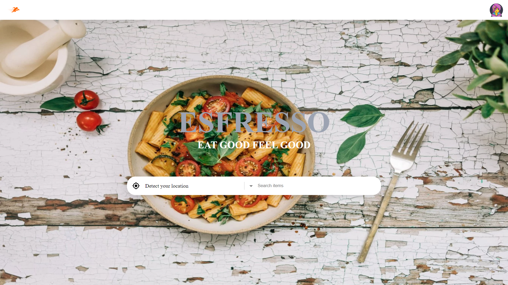

# EsFresso-FoodDeliveryApp(on-going)

## Table of contents

- [Introduction](#introduction)
- [Demo](#demo)
- [Run](#run)
- [Technology](#technology)
- [Features](#features)
- [License](#license)

## Introduction

A virtual Food Delivery website using ,React, Node js, and mongoose.

NOTE: Please read the RUN section before opening an issue.

## Demo

The website resembles a real store and you can add products to your cart and pay for them.

In order to access the admin panel on "/admin" you need to provide the admin email and password.

## Run

To run this application, you have to set your own environmental variables. For security reasons, some variables have been hidden from view and used as environmental variables with the help of dotenv package. Below are the variables that you need to set in order to run the application:

#### Backend

- GOOGLE_CLIENT_ID: This is the Google Client ID for Google signIn.

- TWILIO_SERVICE_ID: This is the Twilio Service Id (string).

- TWILIO_ACCOUNT_SID: This is the Twilio accountSID (string).

- TWILIO_AUTH_TOKEN: This is the Twilio AuthToken (string).

- ACCESS_TOKEN_SECRET: This is the jwt Access Token, Generate Random Secret Id

- REFRESH_TOKEN_SECRET: This is the jwt Refresh Token, Generate Random Secret Id

- PORT: Specify the port Number

- ORIGIN: Mention the frontend Origin

#### frontend

- REACT_APP_serverURL: Backend URL
- REACT_APP_adminURL: Backend URL`/admin`
- REACT_APP_GOOGLE_CLIENT_ID: This is the Google Client ID

After you've set these environmental variables in the .env .Both Frontend and Backend have node modules using `npm install` ,

Now you can run `npm start` in the terminal of both folders and the application should work.

## Technology

The application is built with:

- Node.js
- MongoDB
- React
- Google Authentication
- Twilio
- Material UI

## Features

The application displays a virtual Food Delivery app that contains virtual products and its information.

Users can do the following:

- Create an account, login or logout

Vendors can do the following:

- Create an account, login or logout

Admins can do the following:

- Login or logout to the admin panel
- Manage users and vendors

## License

- MIT License
- Copyright 2022 © [ANAS MULLAPPALLY](https://github.com/anasmullappally)
